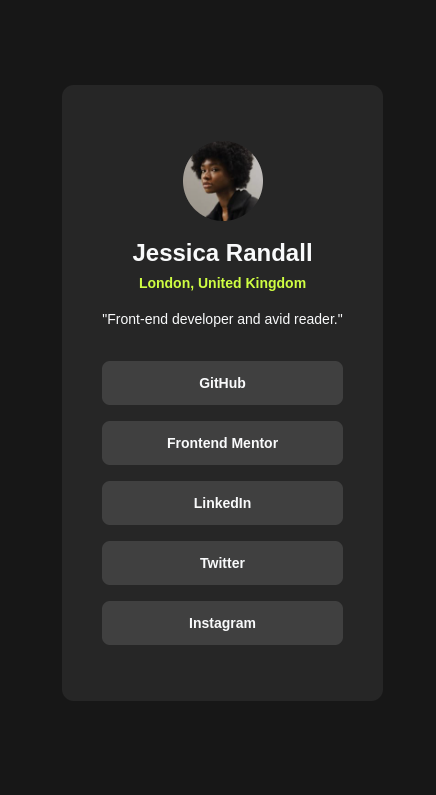

# Frontend Mentor - Social links profile solution

This is a solution to the [Social links profile challenge on Frontend Mentor](https://www.frontendmentor.io/challenges/social-links-profile-UG32l9m6dQ). Frontend Mentor challenges help you improve your coding skills by building realistic projects. 

## Table of contents

- [Overview](#overview)
  - [The challenge](#the-challenge)
  - [Screenshot](#screenshot)
  - [Links](#links)
- [My process](#my-process)
  - [Built with](#built-with)
  - [What I learned](#what-i-learned)
- [Author](#author)

**Note: Delete this note and update the table of contents based on what sections you keep.**

## Overview

### The challenge

Users should be able to:

- See hover and focus states for all interactive elements on the page

### Screenshot

### Links

- Solution URL: [Github Pages SocialLinksProfile](https://lcrergo.github.io/fm-social-links-profile/)

## My process

### Built with

- [Tailwind](https://tailwindcss.com/)

### What I learned

In this project I learned the basics of tailwindcss

## Author

- Github - [LCRERGO](https://github.com/LCRERGO)
- Frontend Mentor - [@LCRERGO](https://www.frontendmentor.io/profile/LCRERGO)
